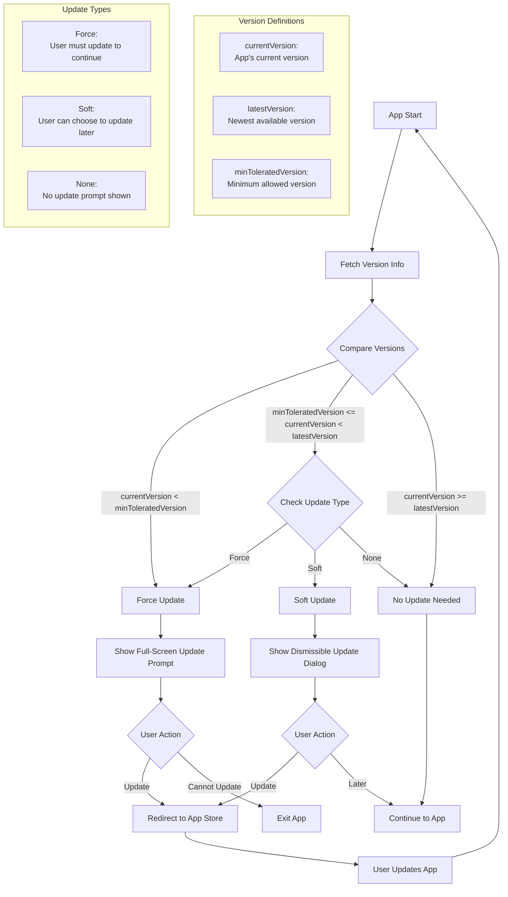

# Force Update Management for Flutter Applications

## Table of Contents
1. [Introduction](#introduction)
2. [Flow Diagram](#flow-diagram)
3. [Explanation of Graph Flow](#explanation-of-graph-flow)
4. [Implementation Guide](#implementation-guide)
5. [Customization](#customization)
6. [Future Improvement Scope](#future-improvement-scope)

## Introduction

The Force Update Management feature ensures Flutter application users are always running the latest version. It provides a seamless way to notify users about updates and guide them through the update process, supporting both soft and forced updates.

## Flow Diagram



## Explanation of Graph Flow

1. **App Start**: The process begins when the app is launched.

2. **Fetch Version Info**: The app retrieves the latest version information from the server.

3. **Compare Versions**: The system compares the current app version with the minimum tolerated version and the latest version.

4. **Update Decision**:
   - If `currentVersion < minToleratedVersion`: Force update is required.
   - If `minToleratedVersion <= currentVersion < latestVersion`: Check the update type (Force, Soft, or None).
   - If `currentVersion >= latestVersion`: No update is needed.

5. **Update Prompts**:
   - Force Update: Shows a full-screen, non-dismissible update prompt.
   - Soft Update: Displays a dismissible update dialog.
   - No Update: The app continues to run normally.

6. **User Actions**:
   - For Force Updates: Users must update or exit the app.
   - For Soft Updates: Users can choose to update now or later.

7. **Update Process**: If the user chooses to update, they are redirected to the app store.

8. **App Restart**: After updating, the process restarts from the beginning.

## Implementation Guide

1. **Setup Dependencies**:
   Add to your `pubspec.yaml`:
   ```yaml
   dependencies:
     http: ^0.13.3
     package_info_plus: ^1.0.6
     url_launcher: ^6.0.12
   ```

2. **Create Core Classes**:
   - `AppVersion`: For version comparison
   - `UpdateInfo`: To hold update information
   - `VersionCheckService`: Abstract class for version checking
   - `ApiVersionCheck`: Implementation of `VersionCheckService`
   - `ForceUpdateManager`: Main class to manage the update process

3. **Implement UI Components**:
   - `UpdateDialog`: For soft updates
   - `ForceUpdateScreen`: For force updates

4. **Initialize in Main App**:
   ```dart
   void main() async {
     WidgetsFlutterBinding.ensureInitialized();
     runApp(const MyApp());
   }

   class MyApp extends StatelessWidget {
     @override
     Widget build(BuildContext context) {
       return MaterialApp(
         home: Builder(
           builder: (context) {
             checkForUpdates(context);
             return YourHomeScreen();
           },
         ),
       );
     }
   }
   ```

5. **Server-Side Setup**:
   Implement an API endpoint returning the latest version information in JSON format.

## Customization

1. **UI Theming**: 
   - Modify `UpdateDialog` and `ForceUpdateScreen` to match your app's design.
   - Customize update messages and button text.

2. **Version Check Logic**: 
   - Extend `VersionCheckService` for custom version checking logic.
   - Implement different comparison strategies if needed.

3. **Update Frequency**: 
   - Adjust the update check frequency in `ForceUpdateManager`.
   - Implement logic to avoid checking too often (e.g., once per day).

4. **Localization**: 
   - Add support for multiple languages in update prompts.

## Future Improvement Scope

1. **Incremental Updates**: 
   - Implement a system for downloading only changed parts of the app.

2. **Background Updates**: 
   - Develop a mechanism to download updates in the background.

3. **A/B Testing**: 
   - Implement A/B testing for update prompts to optimize user engagement.

4. **Analytics Integration**: 
   - Add analytics to track update acceptance rates and user behavior.

5. **Offline Support**: 
   - Implement a strategy for handling update checks when the device is offline.

6. **Custom Update Channels**: 
   - Support different update channels (e.g., beta, stable) for different user groups.

7. **Smart Timing**: 
   - Develop an algorithm to choose the best time to prompt for updates based on user behavior.

8. **Update Rollback**: 
   - Implement a system to roll back to a previous version if issues are detected with a new update.

By following this guide and considering these customization options and future improvements, you can implement a robust and flexible Force Update Management system in your Flutter application.