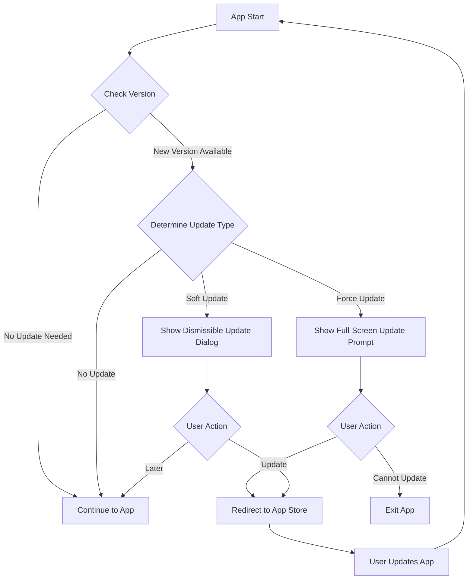

# Force Update Management for Flutter Applications

## Table of Contents
1. [Introduction](#introduction)
2. [How It Works](#how-it-works)
3. [SWOT Analysis](#swot-analysis)
4. [Flow Diagram](#flow-diagram)
5. [Implementation Guide](#implementation-guide)
6. [Customization](#customization)
7. [Best Practices](#best-practices)
8. [Troubleshooting](#troubleshooting)

## Introduction

The Force Update Management feature is a robust solution for Flutter applications to ensure users are always running the latest version of your app. It provides a seamless way to notify users about updates and guide them through the update process, with options for both soft and forced updates.

## How It Works

1. **Version Check**: On app startup, the system checks the current app version against the latest version available (fetched from a server).
2. **Update Determination**: Based on the version comparison and update type (force, soft, or none), the system decides whether to prompt the user for an update.
3. **User Notification**: 
   - For soft updates, a dismissible dialog is shown.
   - For force updates, a full-screen, non-dismissible update prompt is displayed.
4. **Update Process**: When the user chooses to update, they are directed to the appropriate app store or download link.

## SWOT Analysis

### Strengths
- Ensures users have the latest features and security updates
- Flexible handling of soft and force updates
- Seamless integration with Flutter apps
- Customizable UI for update prompts

### Weaknesses
- Requires server-side support for version information
- Network-dependent for checking updates
- May interrupt user experience if not implemented carefully

### Opportunities
- Improve app security by quickly rolling out critical updates
- Increase user engagement with new features
- Reduce support issues related to outdated app versions

### Threats
- Potential user frustration if updates are too frequent
- Risk of app store rejection if force update is too aggressive
- Dependency on reliable server-side version information

## Flow Diagram



## Implementation Guide

1. **Setup Dependencies**:
   Add the following to your `pubspec.yaml`:
   ```yaml
   dependencies:
     http: ^0.13.3
     package_info_plus: ^1.0.6
     url_launcher: ^6.0.12
   ```

2. **Create Required Classes**:
   - `AppVersion`: For version comparison
   - `UpdateInfo`: To hold update information
   - `VersionCheckService`: Abstract class for version checking
   - `ApiVersionCheck`: Concrete implementation of `VersionCheckService`
   - `ForceUpdateManager`: Main class to manage the update process

3. **Implement UI Components**:
   - Create `UpdateDialog` for soft updates
   - Create `ForceUpdateScreen` for force updates

4. **Initialize in Main App**:
   In your `main.dart`, call the update check after the app initializes:

   ```dart
   void main() async {
     WidgetsFlutterBinding.ensureInitialized();
     runApp(const MyApp());
   }

   class MyApp extends StatelessWidget {
     @override
     Widget build(BuildContext context) {
       return MaterialApp(
         home: Builder(
           builder: (context) {
             checkForUpdates(context);
             return YourHomeScreen();
           },
         ),
       );
     }
   }
   ```

5. **Server-Side Setup**:
   Implement an API endpoint that returns the latest version information in JSON format.

## Customization

- **UI Theming**: Modify `UpdateDialog` and `ForceUpdateScreen` to match your app's design.
- **Version Check Logic**: Extend `VersionCheckService` to implement custom version checking logic.
- **Update Frequency**: Adjust the update check frequency in `ForceUpdateManager`.

## Best Practices

1. Use semantic versioning for clear version comparisons.
2. Implement proper error handling for network issues.
3. Provide clear and concise update messages to users.
4. Test thoroughly with different update scenarios.
5. Consider user experience when deciding between soft and force updates.

## Troubleshooting

- **Version Not Updating**: Ensure your `pubspec.yaml` version is updated and a new build is released.
- **Update Check Failing**: Verify network connectivity and server endpoint availability.
- **Users Bypass Force Update**: Check that `ForceUpdateScreen` is properly implemented as non-dismissible.

For more detailed information, refer to the inline documentation in each component of the Force Update Management system.